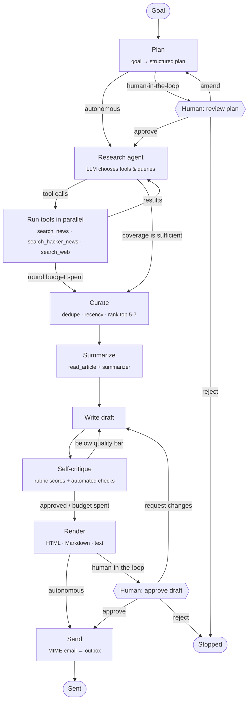

# 📰 Newsletter Agent

[](https://github.com/Devesh-Nix/newsletter-agent/actions/workflows/ci.yml)


An autonomous AI agent, built with **LangGraph**, that turns one plain-English goal:

> *"Create a weekly newsletter on latest AI agent news and send it to our subscribers."*

into a researched, fact-grounded, self-critiqued newsletter, rendered as email-ready HTML
and Markdown and "sent" to a subscriber list. All of it happens in one call:

```python
from newsletter_agent import run_newsletter_agent

result = run_newsletter_agent(
    "Create a weekly newsletter on latest AI agent news and send it to our subscribers."
)
print(result.subject, result.delivery.output_dir)
```

It runs **fully autonomously**, or in **human-in-the-loop** mode where it pauses for you
to approve, amend or reject the plan and the final draft. You can drive it from Python,
from a CLI with a live reasoning timeline, or from a Streamlit web UI.

---

## Contents

- [How the assignment requirements are met](#how-the-assignment-requirements-are-met)
- [Architecture](#architecture)
- [Quick start](#quick-start)
- [Usage](#usage)
- [Deployment](#deployment)
- [Configuration](#configuration)
- [Project layout](#project-layout)
- [Testing](#testing)
- [Design decisions](#design-decisions)
- [Limitations and next steps](#limitations-and-next-steps)

---

## How the assignment requirements are met

| Requirement | Implementation |
|---|---|
| **Goal input** in plain English | `run_newsletter_agent(goal)`. The planner turns the goal into a structured `NewsletterPlan`: topic, audience, tone, time window, story count, search queries and selection criteria. |
| **Research** the latest news | An LLM-driven **tool-calling loop** over keyless public sources: Bing News RSS (with Google News RSS as fallback), the Hacker News Algolia API and, optionally, Tavily. The model chooses tools and queries, reads the results, fills gaps and decides when to stop. |
| **Summarize the top 5-7** articles | Candidates are deduplicated, filtered to the time window and ranked by an "editor-in-chief" LLM step. Each pick's page is downloaded and its main text extracted (trafilatura), then summarised into a faithful structured brief. |
| **Generate a clean newsletter** | The writer produces a structured draft. A Jinja2 **HTML generator** renders email-safe HTML (tables, inline styles, preheader), Markdown and plain text. |
| **Simulate sending** | A real multipart MIME email (`.eml`) plus HTML, Markdown and a JSON delivery receipt is written to `outbox/`. The subject and recipients are printed. |
| **Multi-step reasoning** | A LangGraph state machine: plan → research ⇄ tools → curate → summarize → write ⇄ critique → render → send. |
| **Tool use** (2-3+) | 7 tools: `search_news`, `search_hacker_news`, `search_web` (optional), `read_article`, `summarize_articles`, `render_newsletter`, `send_newsletter`. See [Tools](#tools). |
| **Self-reflection / critique** | Every draft is checked by deterministic editorial rules **and** an LLM critic that scores 6 rubric criteria. Drafts below the quality bar go back to the writer with precise revision instructions, until they pass or the revision budget is spent. |
| **Autonomous**: one function call | `run_newsletter_agent(goal)` does the entire job. |
| **Autonomous ↔ human-in-the-loop toggle** | `mode="autonomous"` or `mode="human_in_the_loop"` (CLI `--mode hitl`, radio toggle in the UI). HITL uses LangGraph `interrupt()` checkpoints. |
| **LangChain / LangGraph** | Pure LangGraph `StateGraph` with LangChain models, tools and prompts. |
| **LLM choice** | Claude, OpenAI, Gemini, Grok or local Ollama through `init_chat_model`. The provider is auto-detected from whichever API key is set. |
| **Simple front end** | Streamlit app (`streamlit run app.py`), plus a CLI. |

---

## Architecture



The graph is defined in [newsletter_agent/graph.py](newsletter_agent/graph.py), with one
module per stage in [newsletter_agent/nodes/](newsletter_agent/nodes/). State is
checkpointed after every step, which is what lets a human-in-the-loop run pause and
resume.

### The reasoning steps

| Step | What happens | Output |
|---|---|---|
| **1. Plan** | Interprets the goal ("weekly" means 7 days), infers audience and tone, writes 4-6 diverse keyword queries (launches, open source, research, enterprise, funding, policy) and selection criteria. Numbers are clamped in code. | `NewsletterPlan` |
| **2. Research** | A ReAct-style loop. The model issues parallel tool calls, sees a compact list of results, notices thin angles and recurring stories, runs follow-up searches and stops when coverage is sufficient (max 3 rounds). If a weak model refuses to call tools, the planned queries run directly. | typically dozens of candidate `Article`s |
| **3. Curate** | Merges duplicates (canonical URLs + headline similarity), drops stale items, builds a source-balanced shortlist, then an editor LLM picks the top N with category and rationale. Picks are validated: unknown ids, repeats and same-story duplicates are replaced. | 5-7 selected stories |
| **4. Summarize** | Downloads each article in parallel and extracts its main text. The summariser writes a headline, a 2-3 sentence summary and a "why it matters" line from **only** that text, falling back to the search snippet for paywalled pages. | `ArticleSummary` per story |
| **5. Write** | Drafts subject, preheader, intro, ordered stories, "the big picture" synthesis and sign-off. Items are reconciled against the real selection, so none are invented and none are lost. | `NewsletterDraft` |
| **6. Critique** | See [Self-reflection](#self-reflection). Loops back to step 5 with instructions when needed. | `ReviewRecord` per draft |
| **7. Render** | Deterministic Jinja2 templates. Autoescaped, http(s) links only, and URLs always come from research data, never from generated text. | HTML, Markdown, text |
| **8. Send** | Builds a `multipart/alternative` email (BCC-style, `List-Unsubscribe` header) and writes it to the outbox with a receipt. | `DeliveryReceipt` |

### Tools

| Tool | Kind | Purpose |
|---|---|---|
| `search_news` | LLM-callable | Bing News RSS (direct article links, snippets, dates); falls back to Google News RSS. No key needed. |
| `search_hacker_news` | LLM-callable | Hacker News via the Algolia API, ranked by points: a developer-interest signal. No key needed. |
| `search_web` | LLM-callable, optional | Tavily news search, registered only when `TAVILY_API_KEY` is set. |
| `read_article` | Pipeline | Fetches a page and extracts its main text with trafilatura; snippet fallback. |
| `summarize_articles` | Pipeline (LLM) | Concurrent, structured, source-faithful summaries with per-article failure isolation. |
| `render_newsletter` | Pipeline | The HTML / Markdown / plain-text generator. |
| `send_newsletter` | Pipeline | The email builder and simulated sender. |

The research tools use LangChain's `content_and_artifact` format. The model reads a compact
text listing (`[3f2a9c1d] Title — Source · Sep 25, 2026 · 265 pts`), which keeps its context
small, while the graph receives fully structured `Article` objects as the artifact.

### Self-reflection

Every draft gets two independent reviews:

1. **Automated editorial checks** ([nodes/critique.py](newsletter_agent/nodes/critique.py)):
   subject and preheader length, preheader not repeating the subject, story count,
   summary length, missing "why it matters" lines, duplicate headlines and stray
   Markdown/HTML. These catch what LLM judges often miss.
2. **LLM critic**: a "demanding senior editor" scores **relevance, accuracy (against the
   source briefs), clarity, engagement, structure and insight** (1-10), and lists
   strengths, issues and concrete revision instructions that quote the text to change.

A draft ships only when the critic approves it, its overall score meets the quality bar
(default 8/10) and no automated check fails. Otherwise the writer gets the combined
feedback and revises. The loop is bounded by `MAX_REVISIONS` (default 2). The full
history is kept, and both UIs show the score progression across drafts.

### Autonomy toggle

| | Fully autonomous | Human-in-the-loop |
|---|---|---|
| Plan | used as-is | **pause**: approve, request changes (re-plan with your feedback) or reject |
| Research → critique | automatic | automatic |
| Final draft | sent once self-review passes | **pause**: preview, then approve & send, request changes (the writer revises with your feedback) or reject |

Pauses are implemented with LangGraph `interrupt()` plus a checkpointer, so the run
resumes exactly where it stopped with `Command(resume=decision)`.

---

## Quick start

Requires Python 3.11+.

```bash
git clone https://github.com/Devesh-Nix/newsletter-agent.git && cd newsletter-agent
python -m venv .venv
# Windows: .venv\Scripts\activate    macOS/Linux: source .venv/bin/activate
pip install -r requirements.txt

cp .env.example .env    # then set ONE of the API keys below
```

| Provider | Set in `.env` | Default model |
|---|---|---|
| Anthropic Claude | `ANTHROPIC_API_KEY` | `claude-opus-5` |
| OpenAI | `OPENAI_API_KEY` | `gpt-6-sol` |
| Google Gemini | `GOOGLE_API_KEY` | `gemini-3.8-flash` |
| xAI Grok | `XAI_API_KEY` | `grok-4.7` |
| Ollama (local, free) | nothing; run `ollama pull qwen3:8b` | `qwen3:8b` |

With `LLM_PROVIDER=auto` (the default), the first provider with a key is used. Override
the model with `LLM_MODEL`. News search needs no keys.

---

## Usage

### Web UI

```bash
streamlit run app.py
```

Choose a mode and a provider in the sidebar, edit the goal and press **Run agent**. You
can watch the timeline of plans, tool calls, thoughts and critiques as it runs. In
human-in-the-loop mode, review panels appear for the plan and for the rendered email.
When it finishes you get the email preview, per-draft critique scores, the selected
research and download buttons for `.html`, `.md` and `.eml`.

### CLI

```bash
python -m newsletter_agent                                   # autonomous, default goal
python -m newsletter_agent --mode hitl                       # approve plan & draft in the terminal
python -m newsletter_agent "A weekly digest of AI agent security news for CISOs" --show
python -m newsletter_agent --provider google_genai --model gemini-3.8-flash --days 14
```

What the live timeline looks like (illustrative excerpt):

```
     plan • Interpreting the goal and drafting a research plan
     plan ✓ Plan ready: 6 stories on 'AI agents' from the last 7 days, 5 search queries
 research › Round 1: decided to run 6 searches — search_news('AI agent launches'), ...
 research ⚙ search_hacker_news('agent framework')
 research ✓ Round 1: 52 results, 52 new (52 unique candidates so far)
   curate • Ranking 40 recent, de-duplicated candidates (from 61 collected) to pick the top 6
summarize ⚙ read_article(transluce.org) → 12,000 characters of article text
 critique › Draft 1 scored 7.0/10 (relevance 9, accuracy 8, clarity 7, engagement 6, ...)
 critique ! Subject line is 74 characters; keep it under 60.
 critique • Not good enough yet; sending it back for revision
 critique ✓ Draft approved by the self-review
  publish ⚙ send_newsletter → '…' delivered to 5 subscribers (simulated; saved to outbox/…)
```

### Python API

```python
from newsletter_agent import HumanDecision, run_newsletter_agent

# Fully autonomous
result = run_newsletter_agent("Create a weekly newsletter on latest AI agent news ...")


# Human-in-the-loop with your own review logic (e.g. Slack approval)
def reviewer(checkpoint: dict) -> HumanDecision:
    if checkpoint["checkpoint"] == "draft_review" and len(checkpoint["subject"]) > 60:
        return HumanDecision(action="revise", feedback="Shorten the subject line.")
    return HumanDecision(action="approve")


result = run_newsletter_agent(goal, mode="human_in_the_loop", reviewer=reviewer)
result.reviews  # every self-critique, with scores
result.rendered  # html / markdown / text
result.delivery  # message id, recipients, output files
```

For step-by-step control (this is what the UI uses), `NewsletterAgent` exposes
`start()`, `pending_review()`, `resume()` and `result()`.

### Output

Each send creates `outbox/<timestamp>-the-agentic-brief/`:

```
newsletter.html   # email-safe HTML (open in a browser)
newsletter.md     # Markdown edition
newsletter.eml    # the full MIME email; opens in Outlook, Apple Mail, Thunderbird
delivery.json     # receipt: message id, subject, recipients, timestamp
```

Subscribers come from [data/subscribers.json](data/subscribers.json).

---

## Deployment

The web UI runs on **Streamlit Community Cloud** (free) straight from this repository:

1. Sign in at [share.streamlit.io](https://share.streamlit.io) with GitHub and choose
   **Create app → Deploy a public app from GitHub**.
2. Repository `Devesh-Nix/newsletter-agent`, branch `main`, main file `app.py`. Optionally
   pick a custom subdomain.
3. Under **Advanced settings**, choose **Python 3.12** and paste your secrets, using
   [.streamlit/secrets.toml.example](.streamlit/secrets.toml.example) as the template:

   ```toml
   GOOGLE_API_KEY = "..."      # or ANTHROPIC_API_KEY / OPENAI_API_KEY / XAI_API_KEY
   APP_PASSWORD = "..."        # only people you give this to can use your API key
   ```

4. Click **Deploy**. The first build takes a few minutes; later pushes to `main` redeploy
   automatically.

How the hosted app stays safe to share:

- **Secrets** are read from `st.secrets` and never shown in the UI.
- **Optional password gate.** With `APP_PASSWORD` set, visitors must enter it before they
  can run the agent on the server's key.
- **Visitor keys stay private.** A key a visitor types into the sidebar lives only in their
  browser session. It is passed directly to the model client and never written to the
  process environment, which is shared by every visitor of a hosted app.
- **Quota-aware.** Model calls are paced to the provider's requests-per-minute quota,
  and the pacing is shared by every visitor using the server's key. When a cap is
  active, all article summaries are written in a single call, cutting a run to about
  9 requests. That is about 2-3 minutes on Gemini's free tier. Rate-limit, 5xx and
  timeout errors are retried with backoff, and anything that still fails is explained
  in plain language.
- **Pinned dependencies.** `requirements.txt` pins the exact versions the test suite runs
  against, so a redeploy can't silently pick up a breaking release.
- **Ephemeral output.** The outbox on the host is temporary, so use the download buttons
  in the Delivery tab.

---

## Configuration

All settings are environment variables (or `.env` entries). The UI and CLI expose the
common ones.

| Variable | Default | Meaning |
|---|---|---|
| `LLM_PROVIDER` | `auto` | `anthropic`, `openai`, `google_genai`, `xai`, `ollama` or `auto` |
| `LLM_MODEL` | per provider | Model name override |
| `LLM_REQUESTS_PER_MINUTE` | auto | Paces model calls to stay inside your quota. Auto means 5 for Gemini (the free-tier limit on Flash models) and no cap for other providers. `0` disables it. |
| `NEWSLETTER_NAME` | `The Agentic Brief` | Masthead and sender name |
| `LOOKBACK_DAYS` | inferred | Force the news window in days. Unset, it is inferred from the goal (weekly = 7) |
| `MIN_ARTICLES` / `MAX_ARTICLES` | `5` / `7` | Bounds on the number of featured stories |
| `MAX_RESEARCH_ROUNDS` | `3` | Tool-calling rounds the researcher may use |
| `MAX_REVISIONS` | `2` | Self-critique revision budget |
| `QUALITY_THRESHOLD` | `8.0` | Critic score a draft needs to pass |
| `TAVILY_API_KEY` | – | Enables the optional `search_web` tool |
| `OUTBOX_DIR` / `SUBSCRIBERS_FILE` | `outbox` / `data/subscribers.json` | Output location and recipient list |

Set `LANGSMITH_TRACING=true` and `LANGSMITH_API_KEY` to get a full trace of every LLM call,
tool call and graph step in LangSmith. No code changes are needed.

---

## Project layout

```
newsletter_agent/
├── agent.py          # run_newsletter_agent() and NewsletterAgent (start / resume / result)
├── graph.py          # LangGraph wiring + strict checkpoint serializer
├── state.py          # AgentState, AgentMode toggle, injected AgentContext, progress events
├── models.py         # Pydantic contracts: Article, NewsletterPlan, Critique, ...
├── prompts.py        # every prompt, in one place
├── llm.py            # provider-agnostic model factory + structured-output helper
├── config.py         # typed settings from env / .env
├── nodes/            # one module per step: planning, research, curation,
│                     #   summarize, writing, critique, publishing
├── tools/            # search, research (LLM tools), reader, summarizer, renderer, mailer
├── templates/        # newsletter.html.j2 / .md.j2 / .txt.j2
└── cli.py            # rich terminal interface
app.py                # Streamlit front end
tests/                # 65 offline tests (scripted LLM, mocked HTTP, Streamlit AppTest)
```

---

## Testing

```bash
pip install -r requirements-dev.txt
pytest          # 65 tests, under 30 s, fully offline, no API keys
ruff check .    # lint
```

The suite runs the **real graph** end to end with a scripted chat model that performs
genuine tool-calling turns and structured outputs, plus fake search tools. It covers:

- the autonomous happy path, stage order and email output
- critique-driven revision and the revision budget
- the tool-skipping fallback and the research round budget
- every human-in-the-loop path: approve, amend plan, amend draft, reject, custom reviewer
- search parsers and fallbacks (mocked HTTP), renderer escaping, MIME output
- node decision logic: pick validation, dedupe, reconciliation, editorial checks
- the Streamlit UI in both modes (`streamlit.testing.AppTest`) and the CLI's prompts and exit codes

CI runs lint and tests on Python 3.11-3.13 ([.github/workflows/ci.yml](.github/workflows/ci.yml)).

---

## Design decisions

- **LangGraph state machine rather than one giant ReAct prompt.** The workflow has a
  known shape (plan → research → write → review → send), so it is explicit and testable.
  Autonomy lives *inside* the steps: the model decides which tools to call, when research
  is sufficient, which stories matter and whether its own draft is good enough.
- **Facts and links can't be hallucinated.** Summaries are written from the extracted
  article text. The writer may only rephrase the briefs. Draft items are reconciled
  against real article ids. URLs are injected by the renderer from research data, and
  the critic scores accuracy against the source briefs.
- **The LLM decides content, code decides format.** Structured outputs plus templates
  make the HTML always well formed and email-client safe. LLM text is autoescaped and
  only `http(s)` links are emitted.
- **Graceful degradation.** A failing source falls back to the next, an unreadable page
  falls back to its snippet, a failed summary falls back to the headline, a model that
  won't call tools falls back to the planned queries, and every loop has a budget.
- **Provider-agnostic.** No provider-specific code in the nodes. Claude uses native
  JSON-schema structured output, because forced tool choice conflicts with Claude's
  adaptive thinking.
- **Dependency injection.** The LLM, tools and reader are passed to nodes through
  LangGraph's run-time context, so tests swap them for fakes without monkeypatching
  internals.
- **Safe checkpoints.** LangGraph's serializer runs in strict mode and only this
  package's own models are allow-listed for deserialization.

## Limitations and next steps

- **Sending is simulated** by design. Swapping `send_newsletter` for SMTP or an email API
  (SES, Resend, Mailchimp) is a single function.
- Checkpoints are in memory. A `SqliteSaver`/`PostgresSaver` would let a human-in-the-loop
  review survive process restarts or happen asynchronously, e.g. via Slack.
- Scheduling weekly issues is left to cron or a job runner. Remembering past issues would
  avoid repeating stories across weeks.
- Keyless news sources are rate-limited and occasionally paywalled; `TAVILY_API_KEY`
  improves coverage.
